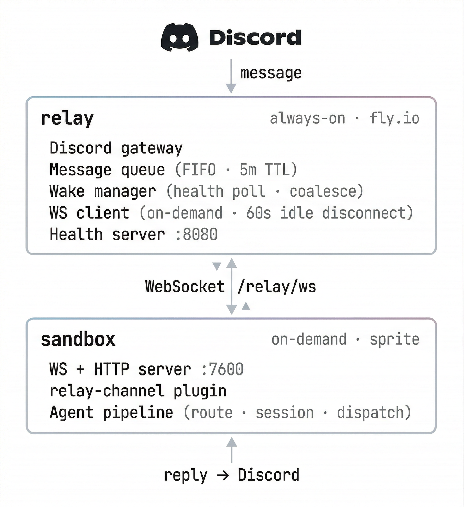

<h1 align="center">🦞 ClawRelay 📡</h1>

A wake-on-message relay bridge that keeps a Discord bot permanently online while letting the AI backend (an OpenClaw sandbox/sprite) sleep to save costs.

The relay stays connected to Discord 24/7, queues incoming messages, optionally wakes a stopped sandbox, forwards messages for processing, and delivers responses back to Discord.

## Architecture

<picture>
  <source media="(prefers-color-scheme: dark)" srcset="docs/arch-dark.png">
  <source media="(prefers-color-scheme: light)" srcset="docs/arch-light.png">
  
</picture>

## Packages

| Package | Description |
|---|---|
| `packages/relay` | Always-on relay service — Discord gateway, message queue, wake manager, callback server |
| `packages/relay-channel` | OpenClaw plugin that runs inside the sandbox, receives forwarded messages and dispatches them through the agent pipeline |

## Features

- **Wake-on-message** — Wakes a sleeping sandbox on first message, polls health until ready, coalesces concurrent wake calls
- **Async callback pattern** — Registers pending callbacks before forwarding; sandbox POSTs responses back when ready (5 min timeout)
- **Message queue** — In-memory FIFO with 5-minute TTL, serial processing
- **DM support** — Handles both guild channels and direct messages
- **Typing indicators** — Shows typing while waiting for AI response (refreshed every 8s, max 3 min)
- **Message splitting** — Splits responses exceeding Discord's 2000-char limit at newlines/spaces
- **Guild/channel allowlists** — Restrict which servers and channels the bot responds in
- **Graceful shutdown** — Clean teardown on SIGINT/SIGTERM

## Configuration

Config is loaded from `relay.config.json` (or `RELAY_CONFIG` env) with environment variable overrides. See [`relay.config.example.json`](packages/relay/relay.config.example.json) for all options.

| Setting | Env var | Default |
|---|---|---|
| Discord token | `DISCORD_TOKEN` | — (required) |
| Sandbox URL | `SANDBOX_PLUGIN_URL` | `http://localhost:7600` |
| Sandbox auth token | `SANDBOX_AUTH_TOKEN` | — (required) |
| Health path | `SANDBOX_HEALTH_PATH` | `/relay/health` |
| Inbound path | `SANDBOX_INBOUND_PATH` | `/relay/inbound` |
| Wake enabled | `WAKE_ENABLED` | `false` |
| Wake URL | `WAKE_URL` | — |
| Callback port | `CALLBACK_PORT` | `7601` |
| Callback external URL | `CALLBACK_EXTERNAL_URL` | — (required) |

## Deployment

### Docker Compose (local)

```bash
# Set your Discord token
export DISCORD_TOKEN=your-token
export SANDBOX_AUTH_TOKEN=your-shared-secret

docker compose --profile discord up
```

This starts both the OpenClaw sandbox (gateway) and the relay service.

### Fly.io

The relay is configured for Fly.io deployment in [`packages/relay/fly.toml`](packages/relay/fly.toml).

```bash
cd packages/relay
fly deploy
fly secrets set DISCORD_TOKEN=your-token SANDBOX_AUTH_TOKEN=your-shared-secret
```

## Development

Requires Node.js 22+. TypeScript is run directly with `tsx` (no build step).

```bash
cd packages/relay
npm install
npx tsx src/index.ts
```

## License

MIT
